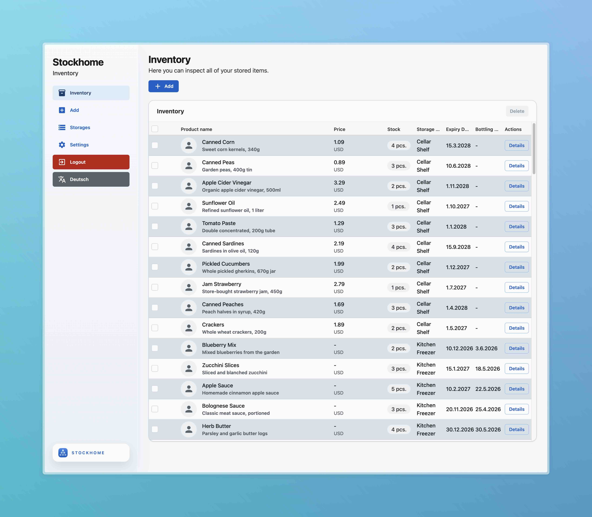

# Stockhome


[](#)


The problem solver for every household in the world: **STOCKHOME**! Have you ever spent too long searching for things in your freezer or pantry? If so, this open-source project is just the right thing for your home server!

<p align="center">
  
</p>

## Features

- Organize your food at home
- Keep track of the Expiry and Bottling date of your food
- Generate QR codes for your food and products to easily scan them with your smartphone to see all the details
- Organize your food and products into different storages (Storage locations)
- Rename your app and change the currency
- Keep track of the stored amount of your food
- Keep track of the costs for your food

## Installation

### 1. Install Docker

If you haven't installed Docker yet, install it by running as root:

```shell
curl -sSL https://get.docker.com | sh
exit
```

### 2. Clone repository

If you haven't installed git, download the source code from this repository from the release page and unpack the `.zip` file.

**OR**

**_Recommended because it is easier to update then:_**

If you want to be always up to date, you can clone this repository by running:

```shell
git clone https://git.the1s.de/theis.gaedigk/stockhome.git
```

> **NOTE:** To do this, you must have git installed. [How to install git?](https://git-scm.com/install/)

### 3. Create `.env` file

In the root directory of this repository create an `.env` file and enter the following records:

```txt
MYSQL_ROOT_PASSWORD=
AUTH_SIGNATURE=
BACKEND_HOST=localhost
```

Make sure that you have set an secure root password and a secure signature.

> **NOTE:** These three values cannot contain special characters.

The `BACKEND_HOST` can be set to the IP address of your server or to `localhost` if you are running the app on your local machine.

> **Change Docker Config:** If you want to run the stack for example in a docker network or want to change something at the docker config, visit the [Docker docs](./.github/docs/docker/README.md) for this project.

### 4. Start Stockhome

First, navigate into the root directory of this repository and run:

```shell
docker compose up -d --build
```

The database and all necessary services are started and initialised automatically.

### 5. First login

The default admin credentials are always:

```
Username: admin
Password: admin
```

_Keep in mind that you should change the password later in the settings page._

> **NOTE:** If errors occur get yourself some help in the [error code page](./.github/docs/error/README.md).

> _I'd be grateful if you could report any bugs as issues here in the repository!_

## Update

To update the stack, navigate into the root directory of this repository and run:

```shell
docker compose pull
docker compose up -d --build
```

## Development

### Prerequisites

- Docker
- Visual Studio Code
- Cloned the repository

### Start backend and database

First, navigate into the root directory of this repository and run:

```shell
docker compose -f docker-compose.dev.yml up -d --build
```

### Start frontend

Navigate into the `frontend` directory and run:

```shell
npm install
npm run dev
```

The frontend is now running on `http://localhost:5173` and the backend is running on `http://localhost:8004`.

## License

This project is licensed under the MIT License - see the [LICENSE](./LICENSE) file for details.

## Contributing

Contributions are welcome! Please feel free to submit a Pull Request.

Whole project made by [Theis Gaedigk](https://portfolio-theis.de)!
